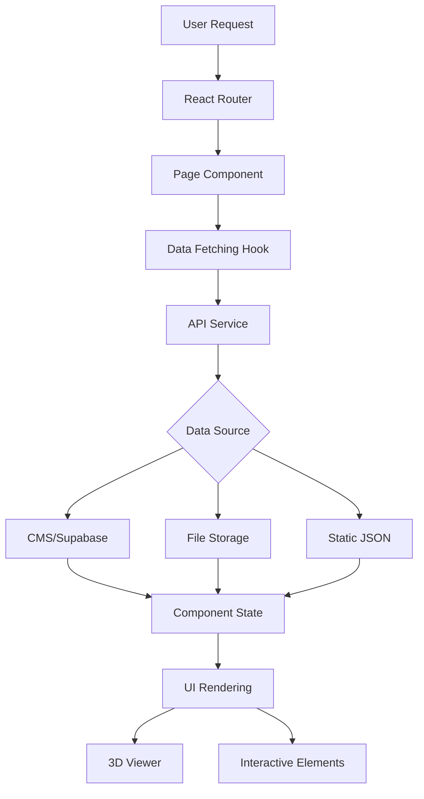
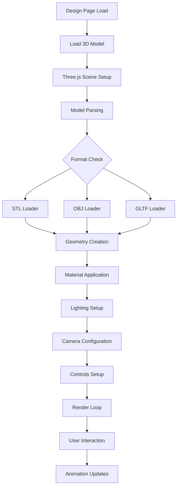
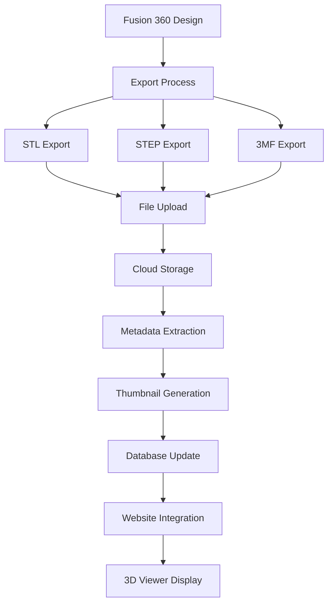
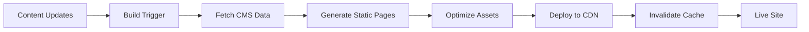

# OpenLights.Art System Architecture

## Overview
OpenLights.Art is a React-based web application with a focus on collaborative design sharing, educational content, and 3D visualization. The system supports multiple creators, comprehensive design documentation, and integrated e-commerce.

## Technology Stack

### Frontend
- **Framework**: React 18 with TypeScript
- **Build Tool**: Vite 5.x
- **UI Library**: Material-UI v5 with Emotion
- **Routing**: React Router v6 (migrating from hash to browser routing)
- **State Management**: Zustand (lightweight alternative to Redux)
- **3D Visualization**: Three.js with React Three Fiber

### Backend Services
- **Hosting**: GitHub Pages (static) with potential migration to Vercel/Netlify
- **CMS**: Strapi (headless) for content management
- **Database**: PostgreSQL via Supabase (for dynamic features)
- **File Storage**: Cloudinary or AWS S3 for 3D models and images
- **E-commerce**: Shopify or Stripe integration

### Development Tools
- **Testing**: Vitest + React Testing Library
- **Linting**: ESLint with TypeScript rules
- **CI/CD**: GitHub Actions
- **Package Management**: Yarn

## Application Architecture

### Component Hierarchy
```
App
├── Layout
│   ├── Header
│   │   ├── Logo
│   │   ├── Navigation
│   │   └── Social Links
│   └── Footer
├── Pages
│   ├── Home
│   │   ├── Hero Section
│   │   ├── Featured Designs
│   │   └── Call-to-Action
│   ├── Designs
│   │   ├── Design Grid
│   │   ├── Filters/Sorting
│   │   └── Design Cards
│   ├── Design Detail
│   │   ├── 3D Viewer
│   │   ├── Specifications
│   │   ├── Build Guide
│   │   └── Downloads
│   ├── Creators
│   │   ├── Creator Grid
│   │   └── Creator Profiles
│   ├── Learn
│   │   ├── Course Modules
│   │   ├── Tutorials
│   │   └── Resources
│   ├── Community
│   │   ├── Build Gallery
│   │   ├── Forums
│   │   └── User Content
│   └── Shop
│       ├── Product Catalog
│       ├── Shopping Cart
│       └── Checkout
```

### Data Flow Architecture



## Content Management Architecture

### Design Content Structure
```json
{
  "design": {
    "id": "beacon-v1",
    "title": "Beacon",
    "creator": "octosafe",
    "version": "1.0.0",
    "description": "...",
    "difficulty": "intermediate",
    "techniques": ["laser", "3d-print", "electronics"],
    "files": {
      "3d": ["beacon.stl", "beacon.step"],
      "laser": ["beacon.svg"],
      "circuit": ["beacon-schematic.pdf"],
      "bom": ["beacon-bom.xlsx"],
      "firmware": ["beacon-wled.bin"]
    },
    "metadata": {
      "dimensions": "100x100x150mm",
      "materials": ["PLA", "Acrylic", "LED Strip"],
      "power": "5V USB",
      "skills_required": ["Basic Soldering", "3D Printing"]
    },
    "build_guide": {
      "steps": [...],
      "videos": [...],
      "tips": [...]
    }
  }
}
```

### Creator Profile Structure
```json
{
  "creator": {
    "id": "octosafe",
    "name": "OpenSafe",
    "bio": "...",
    "expertise": ["3D Design", "Electronics", "Laser Cutting"],
    "social_links": {...},
    "designs": ["beacon", "mirror-cube"],
    "contributions": 15,
    "rating": 4.8
  }
}
```

## 3D Visualization Architecture

### Viewer Integration


### CAD Integration Workflow


## Security and Performance Considerations

### Content Security
- File type validation for uploads
- Size limits for 3D models (max 50MB)
- Virus scanning for downloads
- Access control for creator content

### Performance Optimization
- Lazy loading for 3D models
- Progressive image loading
- CDN for static assets
- Code splitting by routes
- Service worker for caching

## Deployment Architecture

### Static Site Generation


### Dynamic Features
- User authentication via Auth0 or Supabase
- Real-time comments via Socket.io
- E-commerce via Shopify API
- Analytics via Google Analytics/Plausible