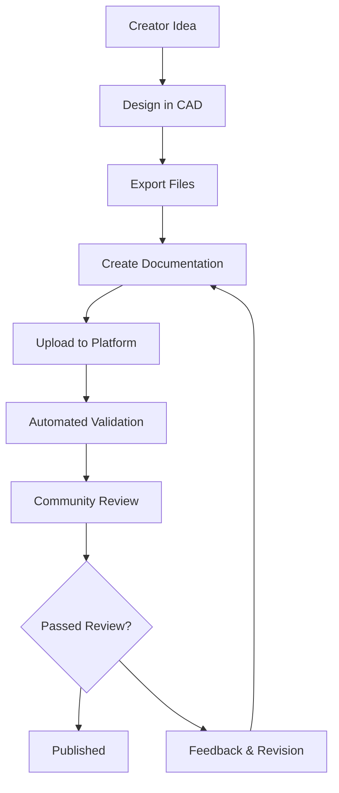

# OpenLights.Art Content Strategy

## Overview
OpenLights.Art content strategy focuses on creating a collaborative platform where creators can easily contribute lighting designs while building comprehensive educational resources. The strategy emphasizes turn-key workflows, quality control, and community engagement.

## Content Types

### 1. Design Content
**Purpose**: Showcase lighting designs with complete build documentation.

**Structure**:
```json
{
  "metadata": {
    "title": "Beacon",
    "creator": "octosafe",
    "version": "1.0.0",
    "difficulty": "intermediate",
    "estimated_time": "4 hours",
    "estimated_cost": "$25-35"
  },
  "description": "Portable lighting device combining laser engraving and 3D printing",
  "specifications": {
    "dimensions": "100x100x150mm",
    "power_source": "5V USB",
    "materials": ["PLA filament", "3mm acrylic", "WS2812B LED strip"],
    "tools_required": ["3D printer", "laser cutter", "soldering iron"]
  },
  "files": {
    "models": ["beacon.stl", "beacon.step"],
    "laser_files": ["beacon_outline.svg", "beacon_engraving.svg"],
    "electronics": ["beacon_schematic.pdf", "beacon_bom.xlsx"],
    "firmware": ["beacon_wled.bin"]
  }
}
```

**Content Guidelines**:
- Include high-quality photos from multiple angles
- Provide detailed BOM with sourcing links
- Document all build steps with images/videos
- Include troubleshooting tips
- Specify skill prerequisites

### 2. Educational Content
**Purpose**: Teach lighting design, fabrication, and electronics skills.

**Modules**:
- **Software Skills**: Fusion 360, light simulation, PCB design
- **Hardware Skills**: Soldering, wiring, power management
- **Design Principles**: Lighting theory, material selection, prototyping
- **Advanced Topics**: IoT integration, custom firmware, manufacturing

**Structure**:
```json
{
  "module": {
    "title": "Introduction to Soldering",
    "level": "beginner",
    "duration": "2 hours",
    "prerequisites": [],
    "learning_objectives": [
      "Identify soldering tools and materials",
      "Practice proper soldering technique",
      "Troubleshoot common soldering issues"
    ],
    "content": {
      "theory": "markdown_content",
      "demonstration": "video_url",
      "practice": "interactive_exercise",
      "assessment": "quiz_questions"
    }
  }
}
```

### 3. Creator Profiles
**Purpose**: Build creator reputation and facilitate collaboration.

**Profile Elements**:
- Professional bio and expertise areas
- Portfolio of designs with metrics
- Social media and contact links
- Contribution history and ratings
- Specializations and preferred techniques

## Content Workflow

### 1. Contribution Process


### 2. Quality Assurance
**Automated Checks**:
- File format validation
- Metadata completeness
- BOM accuracy verification
- Design file integrity

**Community Review**:
- Peer review by experienced creators
- User testing and feedback
- Rating and comment system
- Revision tracking

### 3. Publishing Pipeline
**Staging Process**:
- Draft mode for creators
- Preview functionality
- Automated testing
- SEO optimization

**Live Publication**:
- Version control for updates
- Notification system for followers
- Social media integration
- Analytics tracking

## Content Organization

### Taxonomy
- **By Technique**: 3D Printing, Laser Cutting, Electronics, Mixed Media
- **By Difficulty**: Beginner, Intermediate, Advanced, Expert
- **By Application**: Home Decor, Professional, Educational, Artistic
- **By Creator**: Individual portfolios and collaborations

### Navigation Structure
```
Designs/
├── Featured
├── By Technique/
│   ├── 3D Printing
│   ├── Laser Cutting
│   └── Electronics
├── By Difficulty/
│   ├── Beginner
│   ├── Intermediate
│   └── Advanced
└── By Creator/
    ├── octosafe
    └── [other creators]

Learn/
├── Getting Started
├── Techniques/
│   ├── CAD Design
│   ├── 3D Printing
│   ├── Laser Cutting
│   └── Electronics
├── Projects/
│   ├── Beginner Projects
│   └── Advanced Builds
└── Resources/
    ├── Tools & Materials
    ├── Software
    └── Communities
```

## Content Management System

### Creator Dashboard
**Features**:
- Design upload and management
- Analytics and engagement metrics
- Collaboration invitations
- Revenue tracking (future)
- Profile customization

### Admin Tools
**Moderation**:
- Content approval workflow
- Spam and quality filtering
- User management
- Analytics and reporting

### API Endpoints
- Content submission and updates
- File upload and processing
- Search and filtering
- User management

## Educational Framework

### Learning Paths
**Beginner Path**:
1. Introduction to Lighting Design
2. Basic Electronics
3. 3D Printing Fundamentals
4. Laser Cutting Basics
5. First Project: Simple LED Lamp

**Intermediate Path**:
1. Advanced CAD Techniques
2. Circuit Design
3. Material Science for Lighting
4. Firmware Development
5. Project: Interactive Light Sculpture

**Advanced Path**:
1. IoT Integration
2. Custom PCB Design
3. Manufacturing Processes
4. Business Development
5. Project: Commercial Product Design

### Assessment System
- Quizzes after each module
- Practical project evaluations
- Peer code/design reviews
- Certification upon completion

## Community Engagement

### User-Generated Content
- Build logs and modifications
- Tutorial submissions
- Tool reviews and recommendations
- Photo galleries of completed projects

### Collaboration Features
- Design challenges and contests
- Collaborative design projects
- Mentorship program
- Creator spotlights

### Social Integration
- Share designs to social media
- Embed designs in blogs/forums
- RSS feeds for new content
- Newsletter integration

## Content Scaling Strategy

### Phase 1: Foundation (Months 1-3)
- 5 core designs fully documented
- 10 educational modules
- 3 creator profiles
- Basic contribution workflow

### Phase 2: Growth (Months 4-6)
- 20+ designs
- 25 educational modules
- 10+ active creators
- Community features launched

### Phase 3: Scale (Months 7-12)
- 50+ designs
- 50+ educational modules
- 25+ active creators
- Advanced collaboration tools

## Success Metrics

### Content Quality
- Average design rating: 4.5+ stars
- Completion rate for tutorials: 70%+
- User engagement time: 15+ minutes per session
- Return visitor rate: 40%+

### Community Growth
- Monthly active creators: 25+
- User-generated content submissions: 50+
- Community forum posts: 200+
- Social media shares: 1000+

### Educational Impact
- Tutorial completion certificates: 500+
- Skill assessment improvements: 80% pass rate
- Project success rate: 85%+
- User satisfaction: 90%+

## Challenges and Solutions

### Content Consistency
**Challenge**: Maintaining quality across diverse creators
**Solution**: Comprehensive style guide, template system, peer review process

### Creator Onboarding
**Challenge**: Complex contribution process deterring new creators
**Solution**: Step-by-step wizard, video tutorials, dedicated support

### Content Discoverability
**Challenge**: Users struggling to find relevant content
**Solution**: Advanced search, recommendation engine, curated collections

### Educational Effectiveness
**Challenge**: Ensuring tutorials are engaging and effective
**Solution**: Interactive elements, progress tracking, user feedback integration

## Future Enhancements

### AI-Powered Features
- Automated design categorization
- Content recommendation engine
- Quality assessment assistance
- Personalized learning paths

### Advanced Collaboration
- Real-time collaborative CAD
- Integrated version control
- Design iteration tracking
- Automated conflict resolution

### Global Expansion
- Multi-language support
- Region-specific material sourcing
- Cultural adaptation of designs
- International creator network

This content strategy provides a comprehensive framework for building a thriving creative community around lighting design, with clear processes for contribution, quality assurance, and user engagement.