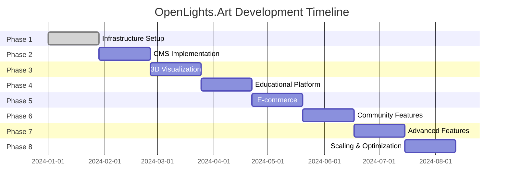

# OpenLights.Art Development Roadmap

## Priority Levels
- 🔥 **Critical**: Blocks core functionality
- ⚡ **High**: Essential for MVP
- 📈 **Medium**: Important enhancements
- 🎯 **Low**: Nice-to-have features
- 🔮 **Future**: Long-term vision

## Phase 1: Infrastructure & Core (Weeks 1-4)

### 🔥 Critical Tasks
- [ ] Update all dependencies to latest stable versions
- [ ] Migrate from hash router to browser router
- [ ] Set up ESLint and Prettier configuration
- [ ] Implement basic error boundaries
- [ ] Add loading states for all async operations
- [ ] Create TypeScript strict mode configuration

### ⚡ High Priority Tasks
- [ ] Set up Vitest testing framework
- [ ] Implement CI/CD pipeline with GitHub Actions
- [ ] Create component library documentation
- [ ] Add SEO meta tags and Open Graph support
- [ ] Implement responsive design audit
- [ ] Set up environment variable management

## Phase 2: Content Management System (Weeks 5-8)

### 🔥 Critical Tasks
- [ ] Design content schema for designs and creators
- [ ] Create JSON-based content management system
- [ ] Implement creator profile pages
- [ ] Build design detail page template
- [ ] Add content validation system

### ⚡ High Priority Tasks
- [ ] Implement file upload system for 3D models
- [ ] Create automated thumbnail generation
- [ ] Build content editing interface
- [ ] Add version control for design files
- [ ] Implement search and filtering system

### 📈 Medium Priority Tasks
- [ ] Create content contribution guidelines
- [ ] Implement draft/publish workflow
- [ ] Add content analytics and metrics
- [ ] Build content import/export tools

## Phase 3: 3D Visualization (Weeks 9-12)

### 🔥 Critical Tasks
- [ ] Integrate Three.js and React Three Fiber
- [ ] Implement STL file loader
- [ ] Create basic 3D viewer component
- [ ] Add model loading states and error handling
- [ ] Implement camera controls (orbit, zoom, pan)

### ⚡ High Priority Tasks
- [ ] Add support for OBJ and GLTF formats
- [ ] Implement model material options
- [ ] Create exploded view functionality
- [ ] Add dimension annotations
- [ ] Build mobile-optimized viewer

### 📈 Medium Priority Tasks
- [ ] Implement AR preview using WebXR
- [ ] Add model comparison tools
- [ ] Create annotation system for designs
- [ ] Build printability analysis features

## Phase 4: Educational Platform (Weeks 13-16)

### ⚡ High Priority Tasks
- [ ] Design learning path structure
- [ ] Create tutorial content framework
- [ ] Implement progress tracking
- [ ] Build interactive code examples
- [ ] Add video embedding system

### 📈 Medium Priority Tasks
- [ ] Create skill assessment system
- [ ] Implement personalized learning recommendations
- [ ] Build community tutorial submission
- [ ] Add certification/badge system

## Phase 5: E-Commerce Integration (Weeks 17-20)

### ⚡ High Priority Tasks
- [ ] Evaluate Shopify vs Stripe integration
- [ ] Implement product catalog structure
- [ ] Create shopping cart functionality
- [ ] Build checkout process
- [ ] Add order management system

### 📈 Medium Priority Tasks
- [ ] Implement product customization
- [ ] Add inventory management
- [ ] Create vendor integration for third-party manufacturing
- [ ] Build analytics and reporting

## Phase 6: Community Features (Weeks 21-24)

### ⚡ High Priority Tasks
- [ ] Implement user authentication
- [ ] Create user profile system
- [ ] Build build gallery with user submissions
- [ ] Add commenting and rating system
- [ ] Implement social sharing features

### 📈 Medium Priority Tasks
- [ ] Create forum/discussion system
- [ ] Add collaborative design challenges
- [ ] Implement creator mentorship program
- [ ] Build notification system

## Phase 7: Advanced Features (Weeks 25-28)

### 📈 Medium Priority Tasks
- [ ] Implement AI-powered design recommendations
- [ ] Add real-time collaboration tools
- [ ] Create mobile companion app
- [ ] Build advanced analytics dashboard
- [ ] Implement internationalization (i18n)

### 🎯 Low Priority Tasks
- [ ] Add dark mode system
- [ ] Implement PWA features
- [ ] Create print-on-demand integration
- [ ] Build API for third-party tools
- [ ] Add accessibility audit and improvements

## Phase 8: Scaling & Optimization (Weeks 29-32)

### 📈 Medium Priority Tasks
- [ ] Performance optimization and monitoring
- [ ] Database migration planning
- [ ] CDN and caching strategy
- [ ] Security audit and hardening
- [ ] Backup and disaster recovery

### 🔮 Future Vision Tasks
- [ ] Machine learning for design optimization
- [ ] IoT integration for smart lighting
- [ ] VR/AR design collaboration
- [ ] Sustainable materials database
- [ ] Global creator network expansion

## Dependencies and Blockers

### Technical Dependencies
- Fusion 360 API availability for direct integration
- 3D model processing service selection
- E-commerce platform decision
- CMS selection and setup

### External Blockers
- Creator onboarding and content creation
- Third-party service API limitations
- Legal considerations for user-generated content
- Manufacturing partner relationships

## Success Metrics

### Phase 1-2 Goals
- 90% test coverage
- <3s page load times
- 100% mobile responsiveness
- Zero critical security issues

### Phase 3-4 Goals
- 10+ complete design documentations
- 5+ educational modules
- 80% user engagement increase
- 50+ active community members

### Phase 5-6 Goals
- $10k+ monthly revenue potential
- 100+ user-generated builds
- 20+ active creators
- 95% user satisfaction rating

## Risk Assessment

### High Risk
- CAD integration complexity
- E-commerce platform selection
- Content moderation at scale
- 3D performance on low-end devices

### Medium Risk
- Creator adoption challenges
- Content quality control
- Technical debt accumulation
- Competition from similar platforms

### Mitigation Strategies
- Start with manual workflows, add automation later
- Pilot e-commerce with small vendor first
- Implement content guidelines and approval processes
- Regular technical debt cleanup sprints
- Competitive analysis and differentiation focus

## Resource Requirements

### Development Team
- 1-2 Frontend Developers (React/TypeScript)
- 1 Backend Developer (Node.js/CMS)
- 1 3D/Graphics Developer
- 1 DevOps Engineer
- 1 Product Manager
- 1 UX/UI Designer

### External Resources
- 3D modeling consultant
- CAD integration specialist
- E-commerce platform expert
- Legal counsel for content licensing

## Timeline and Milestones

## Update Process
This roadmap will be reviewed and updated bi-weekly. Task status should be updated immediately upon completion. New tasks can be added as requirements evolve, with appropriate priority assignment.